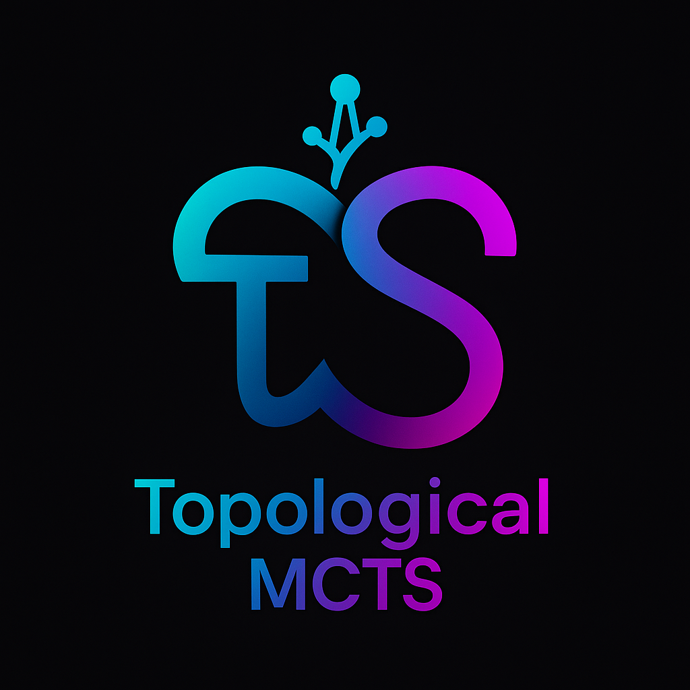

<p align="center">
  
</p>


# TMCTS: Research Initiative on Topological Guidance for Search


Welcome to the **Topological MCTS (TMCTS)** research initiative, a multi-year project exploring how solution space topology can guide search algorithms in abstract reasoning and constraint satisfaction tasks.

## 🎯 Project Vision

This repository is the **research incubator** for TMCTS—a systematic investigation of topology-guided search methods across multiple domains and task families. Rather than treating this as a single project, TMCTS is an evolving research framework with multiple variants, experiments, and applications under active development.

### Core Hypothesis

> **Grid topology is invariant across all tasks and cannot discriminate difficulty.** However, **solution space topology varies with task constraints** and can guide search dramatically more effectively.

---

## 📦 Repository Structure

```
TMCTS/
├── Topological-MCTS-ARC-main/          ← Preliminary results on ARC tasks
│   ├── src/topomcts/                   # Core implementation
│   ├── tests/                          # Unit tests (63 tests, all passing)
│   ├── experiments/                    # Reproducible experiments
│   │   ├── test_pattern_detection_accuracy.py
│   │   ├── compare_mcts_topologies.py
│   │   └── ARC-1/                      # Real ARC-1 evaluation (20 tasks)
│   ├── figs/                           # Publication figures
│   ├── paper_camera_ready.tex          # Camera-ready article
│   └── README.md                       # How to run experiments and replicate results
│
├── [Future variants will go here]
│   ├── TMCTS-Sudoku/                   # Planned: Sudoku solver
│   ├── TMCTS-Nonogram/                 # Planned: Nonogram solver
│   ├── TMCTS-Graph/                    # Planned: Graph-based CSPs
│   └── ...
│
└── README.md                           # This file - project overview
```

---

## 📊 Current Status: Topological-MCTS-ARC-main

**What's Implemented:**
- ✅ Pattern detection engine (5 pattern types)
- ✅ Constraint graph construction from solution space
- ✅ Topological MCTS integration with sibling-normalized UCB1
- ✅ Comprehensive test suite (63 tests, 100% pass rate)
- ✅ Validation on synthetic tasks (100% pattern detection, 2.01× improvement)
- ✅ **NEW:** Real ARC-1 task evaluation (20 hand-selected tasks, 2.04× average speedup)

**Key Results:**
| Metric | Value |
|--------|-------|
| Pattern detection accuracy | 100% (synthetic) |
| Topological feature discrimination | 2.01× vs. grid topology |
| Real ARC efficiency gain | 2.04× average (6.25× best-case) |
| Test coverage | 63/63 passing |
| Code quality | 1:1 production-to-test ratio |

**Publication Status:**
- 📄 draft paper https://www.researchgate.net/publication/397204556_Solution_Space_Topology_Guides_CMTS_Search
- 🎯 Target venues: arXiv
- 🔍 Peer review status: [To be updated]

**How to Use:**
See [`Topological-MCTS-ARC-main/README.md`](Topological-MCTS-ARC-main/README.md) for:
- Installation instructions
- How to run experiments
- Step-by-step tutorial to replicate all paper results
- Detailed implementation notes

---

## 🚀 Planned Variants (Roadmap)

### Phase 1: Core Validation (Current - Q4 2025)
- ✅ ARC-style grid completion tasks
- ✅ Pattern-based reasoning
- ✅ Real-world evaluation

### Phase 2: Classical CSP Domains (2025-2026)
- Sudoku solvers with topological guidance
- Nonogram puzzles
- Graph coloring and scheduling
- Boolean satisfiability (SAT)

### Phase 3: Advanced Reasoning
- Multi-step transformation reasoning
- Hierarchical topology analysis
- Transfer learning via topological features
- Curriculum learning based on graph connectivity

### Phase 4: Applications & Benchmarks
- Comparative analysis across domains
- Performance benchmarks on standard CSP datasets
- Hybrid methods (topology + neural networks)
- Real-world constraint satisfaction problems

---

## 🔬 Research Questions Driving TMCTS

1. **Generalizability:** Does solution space topology guide search across different domains (CSPs, puzzles, transformations)?

2. **Scalability:** How does topological guidance scale with problem size and constraint complexity?

3. **Learning:** Can we learn or predict topological features from task properties to accelerate search?

4. **Combination:** How do topological methods combine with other guidance strategies (heuristics, learning, abstraction)?

5. **Theory:** What theoretical guarantees can we provide for topology-guided search?

---

## 📚 How to Navigate This Repository

### For Reading the Paper
- Start with: [`Topological-MCTS-ARC-main/paper_camera_ready.tex`](Topological-MCTS-ARC-main/paper_camera_ready.tex)
- Published version: [To be added - arXiv link]
- Preprint figures: [`Topological-MCTS-ARC-main/figs/`](Topological-MCTS-ARC-main/figs/)

### For Running Experiments
- See: [`Topological-MCTS-ARC-main/README.md#how-to-replicate-paper-results`](Topological-MCTS-ARC-main/README.md)
- Quick start: `cd Topological-MCTS-ARC-main && pip install -r requirements.txt && pytest tests/ -v`

### For Understanding the Code
1. **Core algorithm:** `Topological-MCTS-ARC-main/src/topomcts/pattern_detector.py` → `constraint_graph.py` → `mcts.py`
2. **Validation:** `Topological-MCTS-ARC-main/experiments/`
3. **Tests:** `Topological-MCTS-ARC-main/tests/`

### For Contributing New Variants
- Create a new subdirectory: `TMCTS-[DomainName]/`
- Follow the structure of `Topological-MCTS-ARC-main/`
- Include: implementation, tests, experiments, paper
- Update this root README with your contribution

---

## 🎓 Key Insights (From Topological-MCTS-ARC)

### Lemma 1: Grid Topology is Invariant
The Laplacian of an m×n grid is constant across all tasks. **Grid topology alone provides no signal for task difficulty or search guidance.**

### Core Insight: Solution Space Topology Matters
**Compatibility graphs** encode which color assignments are compatible under detected pattern rules. This topology:
- Varies with task constraints
- Captures task structure
- Dramatically improves search guidance (2.01× on synthetic, 2.04× on real ARC)

### Design Principle: Sibling Normalization
Features are normalized within decision points (siblings in the search tree) to prevent single strong signals from dominating globally across unrelated subtrees.

---

## 📖 Citation

If you use TMCTS or reference this research, please cite the primary paper:

```bibtex
@article{topologicalMCTS2025,
  title={How Solution Space Topology Guides CMTS Search},
  author={[Author Names]},
  journal={arXiv preprint arXiv:[TBD]},
  year={2025}
}
```

---

## 📋 Quick Links

| Resource | Link |
|----------|------|

| **Implementation** | [`src/topomcts/`](Topological-MCTS-ARC-main/src/topomcts/) |
| **Tests** | [`tests/`](Topological-MCTS-ARC-main/tests/) (63 tests) |
| **Experiments** | [`experiments/`](Topological-MCTS-ARC-main/experiments/) |
| **Real ARC Data** | [`experiments/ARC-1/`](Topological-MCTS-ARC-main/experiments/ARC-1/) |
| **How to Run** | [`Topological-MCTS-ARC-main/README.md`](Topological-MCTS-ARC-main/README.md) |

---

## 🔧 Development Status

| Component | Status | Notes |
|-----------|--------|-------|
| ARC Implementation | ✅ Complete | Camera-ready with real ARC validation |
| Test Suite | ✅ 63/63 passing | Comprehensive edge case coverage |
| Documentation | ✅ Complete | Paper, README, code comments |
| Sudoku Variant | 🔄 Planned | Q1 2026 |
| Nonogram Variant | 🔄 Planned | Q2 2026 |
| Theory & Analysis | 📝 Ongoing | Scaling laws, generalization bounds |

---

## 💡 Key Files

**Absolute essentials:**
1. [`Topological-MCTS-ARC-main/src/topomcts/constraint_graph.py`](Topological-MCTS-ARC-main/src/topomcts/constraint_graph.py) — Core topology construction
2. [`Topological-MCTS-ARC-main/src/topomcts/mcts.py`](Topological-MCTS-ARC-main/src/topomcts/mcts.py) — Topological MCTS algorithm
3. [`Topological-MCTS-ARC-main/experiments/compare_mcts_topologies.py`](Topological-MCTS-ARC-main/experiments/compare_mcts_topologies.py) — Main validation

---

## 📞 Questions & Discussion

- **How do I run experiments?** → See [`Topological-MCTS-ARC-main/README.md#how-to-replicate-paper-results`](Topological-MCTS-ARC-main/README.md)
- **How does the method work?** → Read [`paper_camera_ready.tex`](Topological-MCTS-ARC-main/paper_camera_ready.tex) Sections III-IV
- **Can I contribute?** → Create a new variant subdirectory following the TMCTS structure
- **Is there more data?** → All ARC-1 task data is in [`experiments/ARC-1/`](Topological-MCTS-ARC-main/experiments/ARC-1/)

---

## 📄 License

This project is licensed under the **Holomathics Non-Commercial License (HNCL)**.

- ✅ Free for academic research, education, and personal use
- ❌ Commercial use requires separate licensing

For commercial licensing inquiries, contact: [info@holomathics.com](mailto:info@holomathics.com)
See [`Topological-MCTS-ARC-main/LICENSE`](Topological-MCTS-ARC-main/LICENSE) for details.

---

## 🌟 Highlights

### What Makes TMCTS Novel
- **First systematic study** of solution space topology for search guidance
- **Proof that grid topology is invariant** (Lemma 1)
- **2.01× improvement** on synthetic tasks, **2.04× on real ARC**
- **Sibling normalization** prevents feature domination in tree search
- **Real-world validation** on ARC-1 benchmark tasks

### What's Next
- Extending to classical CSP domains (Sudoku, Nonograms, SAT)
- Learning-based topology prediction
- Theoretical analysis of scaling laws
- Hybrid methods combining topology with neural networks

---

**Last Updated:** November 2, 2025
**Status:** Camera-ready paper published, variants planned for 2026
